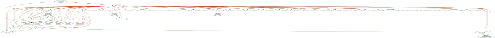

# HW-5.1

## Last activity

**ps xawf**

```jsx
PID TTY      STAT   TIME COMMAND
      2 ?        S      0:00 [kthreadd]
      3 ?        I<     0:00  \_ [rcu_gp]
      4 ?        I<     0:00  \_ [rcu_par_gp]
      5 ?        I<     0:00  \_ [slub_flushwq]
      6 ?        I<     0:00  \_ [netns]
      8 ?        I<     0:00  \_ [kworker/0:0H-events_highpri]
     10 ?        I<     0:00  \_ [mm_percpu_wq]
     11 ?        S      0:00  \_ [rcu_tasks_rude_]
     12 ?        S      0:00  \_ [rcu_tasks_trace]
     13 ?        S      0:00  \_ [ksoftirqd/0]
     14 ?        I      0:00  \_ [rcu_sched]
     15 ?        S      0:00  \_ [migration/0]
     16 ?        S      0:00  \_ [idle_inject/0]
     17 ?        I      0:00  \_ [kworker/0:1-events]
     18 ?        S      0:00  \_ [cpuhp/0]
     19 ?        S      0:00  \_ [cpuhp/1]
     20 ?        S      0:00  \_ [idle_inject/1]
     21 ?        S      0:00  \_ [migration/1]
     22 ?        S      0:00  \_ [ksoftirqd/1]
     24 ?        I<     0:00  \_ [kworker/1:0H-events_highpri]
     25 ?        S      0:00  \_ [kdevtmpfs]
     26 ?        I<     0:00  \_ [inet_frag_wq]
     27 ?        I      0:00  \_ [kworker/1:1-events]
     28 ?        S      0:00  \_ [kauditd]
     29 ?        S      0:00  \_ [khungtaskd]
     30 ?        S      0:00  \_ [oom_reaper]
     31 ?        I<     0:00  \_ [writeback]
     32 ?        S      0:00  \_ [kcompactd0]
     33 ?        SN     0:00  \_ [ksmd]
     34 ?        SN     0:00  \_ [khugepaged]
     80 ?        I<     0:00  \_ [kintegrityd]
     81 ?        I<     0:00  \_ [kblockd]
     82 ?        I<     0:00  \_ [blkcg_punt_bio]
     83 ?        I<     0:00  \_ [tpm_dev_wq]
     84 ?        I<     0:00  \_ [ata_sff]
     85 ?        I<     0:00  \_ [md]
     86 ?        I<     0:00  \_ [edac-poller]
     87 ?        I<     0:00  \_ [devfreq_wq]
     88 ?        S      0:00  \_ [watchdogd]
     90 ?        I<     0:00  \_ [kworker/0:1H-kblockd]
     91 ?        S      0:00  \_ [kswapd0]
     92 ?        S      0:00  \_ [ecryptfs-kthrea]
     94 ?        I<     0:00  \_ [kthrotld]
     95 ?        S      0:00  \_ [irq/13-pciehp]
     96 ?        S      0:00  \_ [irq/14-pciehp]
     97 ?        S      0:00  \_ [irq/15-pciehp]
     98 ?        S      0:00  \_ [irq/16-pciehp]
     99 ?        S      0:00  \_ [irq/17-pciehp]
    100 ?        S      0:00  \_ [irq/18-pciehp]
    101 ?        S      0:00  \_ [irq/19-pciehp]
    102 ?        S      0:00  \_ [irq/20-pciehp]
    103 ?        S      0:00  \_ [irq/21-pciehp]
    104 ?        S      0:00  \_ [irq/22-pciehp]
    105 ?        S      0:00  \_ [irq/23-pciehp]
    106 ?        S      0:00  \_ [irq/24-pciehp]
    107 ?        S      0:00  \_ [irq/25-pciehp]
    108 ?        S      0:00  \_ [irq/26-pciehp]
    109 ?        S      0:00  \_ [irq/27-pciehp]
    110 ?        S      0:00  \_ [irq/28-pciehp]
    111 ?        S      0:00  \_ [irq/29-pciehp]
    112 ?        S      0:00  \_ [irq/30-pciehp]
    113 ?        S      0:00  \_ [irq/31-pciehp]
    114 ?        S      0:00  \_ [irq/32-pciehp]
    115 ?        S      0:00  \_ [irq/33-pciehp]
    116 ?        S      0:00  \_ [irq/34-pciehp]
    117 ?        S      0:00  \_ [irq/35-pciehp]
    118 ?        S      0:00  \_ [irq/36-pciehp]
    119 ?        S      0:00  \_ [irq/37-pciehp]
    120 ?        S      0:00  \_ [irq/38-pciehp]
    121 ?        S      0:00  \_ [irq/39-pciehp]
    122 ?        S      0:00  \_ [irq/40-pciehp]
    123 ?        S      0:00  \_ [irq/41-pciehp]
    124 ?        S      0:00  \_ [irq/42-pciehp]
    125 ?        S      0:00  \_ [irq/43-pciehp]
    126 ?        S      0:00  \_ [irq/44-pciehp]
    127 ?        I<     0:00  \_ [acpi_thermal_pm]
    129 ?        I<     0:00  \_ [mld]
    130 ?        I<     0:00  \_ [ipv6_addrconf]
    140 ?        I<     0:00  \_ [kstrp]
    144 ?        I<     0:00  \_ [zswap-shrink]
    145 ?        I<     0:00  \_ [kworker/u5:0]
    148 ?        I<     0:00  \_ [cryptd]
    149 ?        I      0:00  \_ [kworker/0:2-events]
    187 ?        I<     0:00  \_ [charger_manager]
    211 ?        I<     0:00  \_ [kworker/1:1H-kblockd]
    234 ?        S      0:00  \_ [scsi_eh_0]
    235 ?        I<     0:00  \_ [scsi_tmf_0]
    236 ?        S      0:00  \_ [scsi_eh_1]
    237 ?        I<     0:00  \_ [scsi_tmf_1]
    238 ?        S      0:00  \_ [scsi_eh_2]
    239 ?        I<     0:00  \_ [scsi_tmf_2]
    240 ?        S      0:00  \_ [scsi_eh_3]
    241 ?        I<     0:00  \_ [scsi_tmf_3]
    242 ?        S      0:00  \_ [scsi_eh_4]
    243 ?        I<     0:00  \_ [scsi_tmf_4]
    244 ?        S      0:00  \_ [scsi_eh_5]
    245 ?        I<     0:00  \_ [scsi_tmf_5]
    246 ?        S      0:00  \_ [scsi_eh_6]
    247 ?        I<     0:00  \_ [scsi_tmf_6]
    248 ?        S      0:00  \_ [scsi_eh_7]
    249 ?        I<     0:00  \_ [scsi_tmf_7]
    250 ?        S      0:00  \_ [scsi_eh_8]
    251 ?        I<     0:00  \_ [scsi_tmf_8]
    252 ?        S      0:00  \_ [scsi_eh_9]
    253 ?        I<     0:00  \_ [scsi_tmf_9]
    254 ?        S      0:00  \_ [scsi_eh_10]
    255 ?        I<     0:00  \_ [scsi_tmf_10]
    256 ?        I<     0:00  \_ [nvme-wq]
    257 ?        S      0:00  \_ [scsi_eh_11]
    258 ?        I<     0:00  \_ [nvme-reset-wq]
    259 ?        I<     0:00  \_ [scsi_tmf_11]
    261 ?        I<     0:00  \_ [nvme-delete-wq]
    262 ?        S      0:00  \_ [scsi_eh_12]
    267 ?        I<     0:00  \_ [scsi_tmf_12]
    277 ?        S      0:00  \_ [scsi_eh_13]
    278 ?        I<     0:00  \_ [scsi_tmf_13]
    281 ?        I<     0:00  \_ [ttm_swap]
    283 ?        S      0:00  \_ [irq/45-vmwgfx]
    287 ?        S      0:00  \_ [scsi_eh_14]
    288 ?        I<     0:00  \_ [scsi_tmf_14]
    289 ?        S      0:00  \_ [scsi_eh_15]
    290 ?        I<     0:00  \_ [scsi_tmf_15]
    291 ?        S      0:00  \_ [scsi_eh_16]
    292 ?        I<     0:00  \_ [scsi_tmf_16]
    293 ?        S      0:00  \_ [scsi_eh_17]
    294 ?        I<     0:00  \_ [scsi_tmf_17]
    295 ?        S      0:00  \_ [scsi_eh_18]
    296 ?        I<     0:00  \_ [scsi_tmf_18]
    297 ?        S      0:00  \_ [scsi_eh_19]
    298 ?        I<     0:00  \_ [scsi_tmf_19]
    299 ?        S      0:00  \_ [scsi_eh_20]
    300 ?        I<     0:00  \_ [scsi_tmf_20]
    301 ?        S      0:00  \_ [scsi_eh_21]
    302 ?        I<     0:00  \_ [scsi_tmf_21]
    304 ?        S      0:00  \_ [card0-crtc0]
    307 ?        S      0:00  \_ [scsi_eh_22]
    309 ?        S      0:00  \_ [card0-crtc1]
    311 ?        S      0:00  \_ [card0-crtc2]
    312 ?        I<     0:00  \_ [scsi_tmf_22]
    313 ?        S      0:00  \_ [card0-crtc3]
    325 ?        S      0:00  \_ [card0-crtc4]
    327 ?        S      0:00  \_ [card0-crtc5]
    328 ?        S      0:00  \_ [card0-crtc6]
    329 ?        I      0:00  \_ [kworker/0:3-cgroup_destroy]
    331 ?        S      0:00  \_ [scsi_eh_23]
    332 ?        I<     0:00  \_ [scsi_tmf_23]
    333 ?        S      0:00  \_ [scsi_eh_24]
    334 ?        I<     0:00  \_ [scsi_tmf_24]
    335 ?        S      0:00  \_ [scsi_eh_25]
    336 ?        I<     0:00  \_ [scsi_tmf_25]
    337 ?        S      0:00  \_ [scsi_eh_26]
    338 ?        I<     0:00  \_ [scsi_tmf_26]
    339 ?        S      0:00  \_ [card0-crtc7]
    340 ?        S      0:00  \_ [scsi_eh_27]
    341 ?        I<     0:00  \_ [scsi_tmf_27]
    342 ?        S      0:00  \_ [scsi_eh_28]
    343 ?        I<     0:00  \_ [scsi_tmf_28]
    344 ?        S      0:00  \_ [scsi_eh_29]
    345 ?        I<     0:00  \_ [scsi_tmf_29]
    367 ?        I      0:00  \_ [kworker/u4:25-flush-253:0]
    368 ?        I      0:00  \_ [kworker/u4:26-events_unbound]
    371 ?        I      0:00  \_ [kworker/u4:29-events_unbound]
    381 ?        I<     0:00  \_ [kdmflush]
    415 ?        I<     0:00  \_ [raid5wq]
    463 ?        I<     0:00  \_ [xfsalloc]
    464 ?        I<     0:00  \_ [xfs_mru_cache]
    465 ?        I<     0:00  \_ [xfs-buf/dm-0]
    466 ?        I<     0:00  \_ [xfs-conv/dm-0]
    467 ?        I<     0:00  \_ [xfs-reclaim/dm-]
    468 ?        I<     0:00  \_ [xfs-blockgc/dm-]
    469 ?        I<     0:00  \_ [xfs-inodegc/dm-]
    470 ?        I<     0:00  \_ [xfs-log/dm-0]
    471 ?        I<     0:00  \_ [xfs-cil/dm-0]
    472 ?        S      0:00  \_ [xfsaild/dm-0]
    564 ?        I      0:00  \_ [kworker/1:3-events]
    575 ?        I<     0:00  \_ [kaluad]
    578 ?        I<     0:00  \_ [kmpath_rdacd]
    580 ?        I<     0:00  \_ [kmpathd]
    581 ?        I<     0:00  \_ [kmpath_handlerd]
    681 ?        S      0:00  \_ [jbd2/nvme0n1p2-]
    683 ?        I<     0:00  \_ [ext4-rsv-conver]
      1 ?        Ss     0:02 /lib/systemd/systemd --system --deserialize 36
    868 ?        Ss     0:00 /usr/sbin/cron -f -P
    870 ?        Ss     0:00 @dbus-daemon --system --address=systemd: --nofork --nopidfile --systemd-activation --syslog-only
    877 ?        Ss     0:00 /usr/bin/python3 /usr/bin/networkd-dispatcher --run-startup-triggers
    882 ?        Ssl    0:00 /usr/lib/snapd/snapd
    884 ?        Ss     0:00 /lib/systemd/systemd-logind
    896 tty1     Ss     0:00 /bin/login -p --
   1208 tty1     S+     0:00  \_ -bash
    942 ?        Ssl    0:00 /usr/bin/python3 /usr/share/unattended-upgrades/unattended-upgrade-shutdown --wait-for-signal
   1199 ?        Ss     0:00 /lib/systemd/systemd --user
   1200 ?        S      0:00  \_ (sd-pam)
   3013 ?        Ssl    0:00 /usr/sbin/irqbalance --foreground
   3161 ?        Ss     0:00 /lib/systemd/systemd-udevd
   3374 ?        Ss     0:00 /lib/systemd/systemd-networkd
   3380 ?        Ss     0:00 /lib/systemd/systemd-resolved
   3383 ?        S<s    0:00 /lib/systemd/systemd-journald
   3460 ?        Ssl    0:00 /lib/systemd/systemd-timesyncd
   3834 ?        SLsl   0:00 /sbin/multipathd -d -s
   3856 ?        Ssl    0:00 /usr/sbin/rsyslogd -n -iNONE
  16722 ?        Ssl    0:00 /usr/libexec/packagekitd
  16723 ?        Ss     0:00 sshd: /usr/sbin/sshd -D [listener] 0 of 10-100 startups
  17489 ?        Ss     0:00  \_ sshd: olit [priv]
  17535 ?        S      0:00      \_ sshd: olit@pts/0
  17536 pts/0    Ss     0:00          \_ -bash
  17548 pts/0    R+     0:00              \_ ps xawf
  16724 ?        Ss     0:00 /usr/bin/VGAuthService
  16725 ?        Ssl    0:00 /usr/bin/vmtoolsd
  16726 ?        Ssl    0:00 /usr/libexec/polkitd --no-debug
  16735 ?        Ssl    0:00 /usr/libexec/udisks2/udisksd
  16736 ?        Ssl    0:00 /usr/sbin/ModemManager
```

> *Команда `ps` використовується для виведення інформації про процеси в системі. Параметри `xawf` визначають, яку інформацію буде виведено.*
> 
> - `*x` - виводить ієрархію процесів.*
> - `*a` - виводить всі процеси, включаючи фонові процеси.*
> - `*w` - виводить ім'я користувача, якому належить процес.*
> - `*f` - виводить команди, що запускають процеси.*
> 
> *Отже, команда `ps xawf` виводить наступну інформацію про процеси:*
> 
> - *PID - ідентифікатор процесу.*
> - *USER - ім'я користувача, якому належить процес.*
> - *CGROUP - ім'я контрольної групи, в якій знаходиться процес.*
> - *COMMAND - команда, що запускає процес.*

**systemd-analyze**

```jsx
Startup finished in 3.703s (kernel) + 5.738s (userspace) = 9.441s
graphical.target reached after 5.522s in userspace
```

> *Команда `systemd-analyze` використовується для аналізу стану системи та її продуктивності. Вона може використовуватися для отримання інформації про такі аспекти системи, як:*
> 
> - *Час завантаження системи*
> - *Час запуску кожного модуля системи*
> - *Залежності між модулями системи*
> - *Стан модулів системи*
> 
> *Команда `systemd-analyze` має безліч опцій, які дозволяють налаштувати її вивід. Деякі з найпоширеніших опцій включають:*
> 
> - `*p` - виводить інформацію про час завантаження системи*
> - `*t` - виводить інформацію про час запуску кожного модуля системи*
> - `*d` - виводить інформацію про залежності між модулями системи*
> - `*s` - виводить інформацію про стан модулів системи*

**systemd-analyze blame**

```jsx
1.770s snap.lxd.activate.service
1.426s systemd-random-seed.service
1.372s snapd.service
1.039s systemd-networkd-wait-online.service
1.018s dev-mapper-ubuntu\x2d\x2dvg\x2dubuntu\x2d\x2dlv.device
 717ms dev-loop1.device
 713ms dev-loop4.device
 699ms dev-loop2.device
 695ms dev-loop3.device
 679ms dev-loop0.device
 526ms cloud-init-local.service
 364ms snapd.apparmor.service
 356ms systemd-udev-trigger.service
 265ms cloud-init.service
 221ms cloud-config.service
 214ms cloud-final.service
 204ms networkd-dispatcher.service
 172ms keyboard-setup.service
 113ms systemd-logind.service
 109ms snapd.seeded.service
  85ms apparmor.service
  81ms update-notifier-download.service
  73ms secureboot-db.service
  71ms udisks2.service
  70ms apport.service
  62ms user@1000.service
  61ms systemd-journal-flush.service
  61ms e2scrub_reap.service
  56ms lvm2-monitor.service
  52ms ssh.service
  51ms modprobe@efi_pstore.service
  45ms grub-common.service
  45ms systemd-modules-load.service
  42ms lvm2-pvscan@259:3.service
  41ms systemd-remount-fs.service
  41ms sys-kernel-debug.mount
  40ms sys-kernel-tracing.mount
  38ms dev-hugepages.mount
  38ms dev-mqueue.mount
  37ms packagekit.service
  35ms kmod-static-nodes.service
  35ms systemd-resolved.service
  34ms modprobe@drm.service
  33ms modprobe@configfs.service
  33ms modprobe@fuse.service
  29ms systemd-timesyncd.service
  27ms ModemManager.service
  26ms systemd-sysctl.service
  23ms systemd-tmpfiles-clean.service
  22ms systemd-binfmt.service
  20ms systemd-sysusers.service
  20ms plymouth-read-write.service
  19ms systemd-tmpfiles-setup.service
  18ms systemd-networkd.service
  18ms swap.img.swap
  18ms sys-fs-fuse-connections.mount
  18ms systemd-udevd.service
  16ms polkit.service
  16ms systemd-fsck@dev-disk-by\x2duuid-1773\x2d44F5.service
  15ms systemd-fsck@dev-disk-by\x2duuid-02df4a42\x2d8863\x2d4cea\x2db8e2\x2d2a24b0428058.service
  15ms sys-kernel-config.mount
  14ms plymouth-quit.service
  12ms systemd-tmpfiles-setup-dev.service
  12ms grub-initrd-fallback.service
  11ms console-setup.service
  11ms snap-core20-2107.mount
  11ms snap-snapd-19459.mount
  11ms multipathd.service
  11ms snap-snapd-20674.mount
  11ms snap-core20-1977.mount
  10ms snap-lxd-24326.mount
  10ms boot-efi.mount
  10ms finalrd.service
   9ms systemd-journald.service
   8ms proc-sys-fs-binfmt_misc.mount
   7ms plymouth-quit-wait.service
   6ms user-runtime-dir@1000.service
   6ms systemd-update-utmp.service
   5ms systemd-update-utmp-runlevel.service
   5ms systemd-user-sessions.service
   4ms ufw.service
   3ms setvtrgb.service
   3ms boot.mount
   2ms rsyslog.service
   2ms snapd.socket
  12us blk-availability.service
```

> *Команда `systemd-analyze blame` використовується для аналізу часу запуску модулів системи. Вона виводить список всіх модулів системи, упорядкований за часом їх запуску.*
> 
> 
> *Вивід команди `systemd-analyze blame` містить наступну інформацію про кожний модуль:*
> 
> - *Ім'я модуля*
> - *Час запуску модуля*
> - *Залежності модуля*

**systemd-analyze critical-chain**

```jsx
The time when unit became active or started is printed after the "@" character.
The time the unit took to start is printed after the "+" character.

graphical.target @5.522s
└─multi-user.target @5.522s
  └─snapd.seeded.service @5.125s +109ms
    └─snapd.service @3.751s +1.372s
      └─basic.target @3.731s
        └─sockets.target @3.731s
          └─snapd.socket @3.729s +2ms
            └─sysinit.target @3.718s
              └─cloud-init.service @3.451s +265ms
                └─cloud-init-local.service @1.319s +526ms
                  └─systemd-remount-fs.service @253ms +41ms
                    └─systemd-journald.socket @213ms
                      └─system.slice @194ms
                        └─-.slice @194ms
```

> *Команда `systemd-analyze critical-chain` використовується для візуалізації послідовності модулів, які безпосередньо впливають на час завантаження вашої Linux-системи. Вона допомагає визначити вузькі місця та ідентифікувати модулі, які займають найбільше часу на запуск, потенційно сповільнюючи процес завантаження.

У output є символи, про що вони говорять, якщо коротко, то про:*
> 
> - ***Символ @**, за яким слідує число: час, що минув від завантаження, коли модуль став активним або запущеним.*
> - ***Символ +**, за яким слідує число: час, який знадобився для запуску модуля.*

**sudo apt install graphviz**

У виводі буде відображатися процес встановлення апки, з усіма її залежностями

> ***graphviz** використовує мову опису графів.*
> 

**systemd-analyze plot > bootup.svg**


> *Команда `systemd-analyze plot` використовується для створення графіка, що показує час запуску модулів системи за часом. Графік створюється у форматі SVG.
Результат роботи приведений на скріні вище.*
> 

**systemd-analyze dot --to-pattern='**.target' --from-pattern='**.target' | dot -Tsvg > targets.svg** (команда з прикладу, давала чомусь пустий результат)



> *Ця команда використовується для створення графа, що показує залежність між цілями systemd. Графік створюється у форматі SVG.*
> 

**systemctl show-environment**

```jsx
LANG=en_US.UTF-8
PATH=/usr/local/sbin:/usr/local/bin:/usr/sbin:/usr/bin:/sbin:/bin:/snap/bin
```

> *Використовується для виведення інформації про середовище systemd*
> 

**systemctl cat sshd.service**

```jsx
[Unit]
Description=OpenBSD Secure Shell server
Documentation=man:sshd(8) man:sshd_config(5)
After=network.target auditd.service
ConditionPathExists=!/etc/ssh/sshd_not_to_be_run

[Service]
EnvironmentFile=-/etc/default/ssh
ExecStartPre=/usr/sbin/sshd -t
ExecStart=/usr/sbin/sshd -D $SSHD_OPTS
ExecReload=/usr/sbin/sshd -t
ExecReload=/bin/kill -HUP $MAINPID
KillMode=process
Restart=on-failure
RestartPreventExitStatus=255
Type=notify
RuntimeDirectory=sshd
RuntimeDirectoryMode=0755

[Install]
WantedBy=multi-user.target
Alias=sshd.service
```

> *Використовується для виведення вмісту файлу модуля systemd з іменем `sshd.service`. Файл модуля systemd містить інформацію про модуль, включаючи його назву, тип, опис, залежності, поведінку та інші властивості.*
> 

**systemctl show sshd.service**

```jsx
Type=notify
Restart=on-failure
NotifyAccess=main
RestartUSec=100ms
TimeoutStartUSec=1min 30s
TimeoutStopUSec=1min 30s
TimeoutAbortUSec=1min 30s
TimeoutStartFailureMode=terminate
TimeoutStopFailureMode=terminate
RuntimeMaxUSec=infinity
WatchdogUSec=0
WatchdogTimestamp=n/a
WatchdogTimestampMonotonic=0
RootDirectoryStartOnly=no
RemainAfterExit=no
GuessMainPID=yes
RestartPreventExitStatus=255
MainPID=1527
ControlPID=0
FileDescriptorStoreMax=0
NFileDescriptorStore=0
StatusErrno=0
Result=success
ReloadResult=success
CleanResult=success
UID=[not set]
GID=[not set]
NRestarts=0
OOMPolicy=stop
ExecMainStartTimestamp=Sat 2024-01-13 12:15:31 UTC
ExecMainStartTimestampMonotonic=14042009
ExecMainExitTimestamp=n/a
ExecMainExitTimestampMonotonic=0
ExecMainPID=1527
ExecMainCode=0
ExecMainStatus=0
ExecStartPre={ path=/usr/sbin/sshd ; argv[]=/usr/sbin/sshd -t ; ignore_errors=no ; start_time=[n/a] ; stop_time=[n/a] ; pid=0 ; code=(null) ; status=0/0>
ExecStartPreEx={ path=/usr/sbin/sshd ; argv[]=/usr/sbin/sshd -t ; flags= ; start_time=[n/a] ; stop_time=[n/a] ; pid=0 ; code=(null) ; status=0/0 }
ExecStart={ path=/usr/sbin/sshd ; argv[]=/usr/sbin/sshd -D $SSHD_OPTS ; ignore_errors=no ; start_time=[n/a] ; stop_time=[n/a] ; pid=0 ; code=(null) ; st>
ExecStartEx={ path=/usr/sbin/sshd ; argv[]=/usr/sbin/sshd -D $SSHD_OPTS ; flags= ; start_time=[n/a] ; stop_time=[n/a] ; pid=0 ; code=(null) ; status=0/0>
ExecReload={ path=/usr/sbin/sshd ; argv[]=/usr/sbin/sshd -t ; ignore_errors=no ; start_time=[n/a] ; stop_time=[n/a] ; pid=0 ; code=(null) ; status=0/0 }
ExecReload={ path=/bin/kill ; argv[]=/bin/kill -HUP $MAINPID ; ignore_errors=no ; start_time=[n/a] ; stop_time=[n/a] ; pid=0 ; code=(null) ; status=0/0 }
ExecReloadEx={ path=/usr/sbin/sshd ; argv[]=/usr/sbin/sshd -t ; flags= ; start_time=[n/a] ; stop_time=[n/a] ; pid=0 ; code=(null) ; status=0/0 }
ExecReloadEx={ path=/bin/kill ; argv[]=/bin/kill -HUP $MAINPID ; flags= ; start_time=[n/a] ; stop_time=[n/a] ; pid=0 ; code=(null) ; status=0/0 }
Slice=system.slice
ControlGroup=/system.slice/ssh.service
MemoryCurrent=6787072
MemoryAvailable=infinity
CPUUsageNSec=86731000
EffectiveCPUs=0-1
EffectiveMemoryNodes=0
TasksCurrent=1
IPIngressBytes=[no data]
IPIngressPackets=[no data]
IPEgressBytes=[no data]
IPEgressPackets=[no data]
IOReadBytes=18446744073709551615
IOReadOperations=18446744073709551615
```

> *Використовується для виведення інформації про модуль `systemd` з іменем `sshd.service`*
> 

**systemctl show sshd.service -p ExecMainPID**

```jsx
ExecMainPID=1527
```

> *Використовується для виведення значення властивості `ExecMainPID` модуля systemd з іменем `sshd.service`*
> 

**systemctl show sshd.service -p ExecMainPID --value**

```jsx
1527
```

> *Команда `systemctl show sshd.service -p ExecMainPID --value` виведе значення властивості `ExecMainPID` модуля SSH.*
> 

## Last activity Working with systemd service

**sudo apt install cups**

У виводі буде відображатися процес встановлення апки, з усіма її залежностями

> *Пакет `cups` містить програмне забезпечення, необхідне для запуску сервера друку.*
> 

**systemctl status cups**

```jsx
cups.service - CUPS Scheduler
     Loaded: loaded (/lib/systemd/system/cups.service; enabled; vendor preset: enabled)
     Active: active (running) since Tue 2024-01-16 14:07:20 UTC; 4min 6s ago
TriggeredBy: ● cups.socket
             ● cups.path
       Docs: man:cupsd(8)
   Main PID: 4856 (cupsd)
     Status: "Scheduler is running..."
      Tasks: 1 (limit: 4521)
     Memory: 2.9M
        CPU: 386ms
     CGroup: /system.slice/cups.service
             └─4856 /usr/sbin/cupsd -l

Jan 16 14:07:20 uhost1 systemd[1]: Starting CUPS Scheduler...
Jan 16 14:07:20 uhost1 systemd[1]: Started CUPS Scheduler.
```

> *Команда виводить інформацію про стан сервера друку.*
> 

**sudo systemctl stop cups**

```jsx
Warning: Stopping cups.service, but it can still be activated by:
  cups.socket
  cups.path
```

> *Команда зупиняє сервіс `cups`*
> 

**systemctl status cups**

```jsx
○ cups.service - CUPS Scheduler
     Loaded: loaded (/lib/systemd/system/cups.service; enabled; vendor preset: enabled)
     Active: inactive (dead) since Tue 2024-01-16 14:12:48 UTC; 33s ago
TriggeredBy: ○ cups.socket
             ○ cups.path
       Docs: man:cupsd(8)
    Process: 4856 ExecStart=/usr/sbin/cupsd -l (code=exited, status=0/SUCCESS)
   Main PID: 4856 (code=exited, status=0/SUCCESS)
     Status: "Scheduler is running..."
        CPU: 404ms

Jan 16 14:07:20 uhost1 systemd[1]: Starting CUPS Scheduler...
Jan 16 14:07:20 uhost1 systemd[1]: Started CUPS Scheduler.
Jan 16 14:12:48 uhost1 systemd[1]: Stopping CUPS Scheduler...
Jan 16 14:12:48 uhost1 systemd[1]: cups.service: Deactivated successfully.
Jan 16 14:12:48 uhost1 systemd[1]: Stopped CUPS Scheduler.
```

> *Дана команда виводить інформацію про вже зупинений сервіс*
> 

**sudo systemctl start cups**

```jsx
Без output
```

> *Дана команда запускає сервіс.*
> 

**systemctl cat cups.service**

```jsx
# /lib/systemd/system/cups.service
[Unit]
Description=CUPS Scheduler
Documentation=man:cupsd(8)
After=network.target nss-user-lookup.target nslcd.service
Requires=cups.socket

[Service]
ExecStart=/usr/sbin/cupsd -l
Type=notify
Restart=on-failure

[Install]
Also=cups.socket cups.path
WantedBy=printer.target multi-user.target
```

> *Команда використовується для виведення вмісту файлу модуля.*
> 

**systemctl show cups -p MemoryMax**

```jsx
MemoryMax=infinity
```

> *Команда використовується для виведення значення властивості `MemoryMax` модуля systemd з іменем `cups`. Властивість `MemoryMax` визначає максимальну кількість пам'яті, яку може використовувати модуль.*
> 

**sudo systemctl set-property cups MemoryMax=2G**

```jsx
Без output
```

> *Дана команда задає нове значення для `MemoryMax` .*
> 

**systemctl cat cups.service**

```jsx
# /lib/systemd/system/cups.service
[Unit]
Description=CUPS Scheduler
Documentation=man:cupsd(8)
After=network.target nss-user-lookup.target nslcd.service
Requires=cups.socket

[Service]
ExecStart=/usr/sbin/cupsd -l
Type=notify
Restart=on-failure

[Install]
Also=cups.socket cups.path
WantedBy=printer.target multi-user.target

# /etc/systemd/system.control/cups.service.d/50-MemoryMax.conf
# This is a drop-in unit file extension, created via "systemctl set-property"
# or an equivalent operation. Do not edit.
**[Service]
MemoryMax=2147483648**
```

> *Команда використовується для виведення вмісту файлу модуля. Те, що виділено курсивом, показує нам нові значення, які були сетнуті.*
> 

**sudo rm -rf /etc/systemd/system.control/cups.service.d**

```jsx
 Без output
```

> *Команда видалить всі файли, які можуть налаштовувати поведінку модуля CUPS*
> 

**sudo systemctl daemon-reload**

```jsx
Без output
```

> *Команда використовується для перезавантаження демона systemd*
> 

**sudo systemctl restart cups.service**

```jsx
Без output
```

> *Команда використовується для перезавантаження сервісу*
> 

**sudo systemctl cat cups.service**

```jsx
# /lib/systemd/system/cups.service
[Unit]
Description=CUPS Scheduler
Documentation=man:cupsd(8)
After=network.target nss-user-lookup.target nslcd.service
Requires=cups.socket

[Service]
ExecStart=/usr/sbin/cupsd -l
Type=notify
Restart=on-failure

[Install]
Also=cups.socket cups.path
WantedBy=printer.target multi-user.target
```

> *Команда використовується для виведення вмісту файлу модуля. Але тут можемо замітити, що після того, коли було видалено файли, які обумовлюють поведінку модуля, значення, яке ми сетали для обмеження використання RAM було скинуто.*
> 

**sudo systemctl status cups.service**

```jsx
● cups.service - CUPS Scheduler
     Loaded: loaded (/lib/systemd/system/cups.service; enabled; vendor preset: enabled)
     Active: active (running) since Tue 2024-01-16 14:29:00 UTC; 13min ago
TriggeredBy: ● cups.socket
             ○ cups.path
       Docs: man:cupsd(8)
   Main PID: 5297 (cupsd)
     Status: "Scheduler is running..."
      Tasks: 1 (limit: 4521)
     Memory: 1.8M
        CPU: 17ms
     CGroup: /system.slice/cups.service
             └─5297 /usr/sbin/cupsd -l

Jan 16 14:29:00 uhost1 systemd[1]: Starting CUPS Scheduler...
Jan 16 14:29:00 uhost1 systemd[1]: Started CUPS Scheduler.
```

> *Дана команда виводить інформацію про запущений сервіс.*
> 

## Last activity Working with systemd Targets

**runlevel**

```jsx
N 5
```

> *Команда використовується для виведення поточного рівня виконання системи.*
> 

**systemctl get-default**

```jsx
graphical.target
```

> 
> 

**sudo systemctl set-default multi-user.target**

```jsx
Created symlink /etc/systemd/system/default.target → /lib/systemd/system/multi-user.target.
```

> 
> 

**sudo systemctl isolate default.target**

```jsx
Без output
```

> 
> 

**runlevel**

```jsx
5 3
```

> 
> 

**systemctl list-units -t target | grep graphical**

```jsx
Без output
```

> 
> 

**systemctl list-units -t target --all**

```jsx
UNIT                                                                                                                    LOAD   ACTIVE   SUB    DESCRIP>
  basic.target                                                                                                            loaded active   active Basic S>
  blockdev@dev-disk-by\x2did-dm\x2duuid\x2dLVM\x2d66tErsSjRVPGtBRZYQ5d25BmoQR5Gljb6Lz0NJHCxGXsHcBPmgDbcdv7pUbTxeUu.target loaded inactive dead   Block D>
  blockdev@dev-disk-by\x2duuid-02df4a42\x2d8863\x2d4cea\x2db8e2\x2d2a24b0428058.target                                    loaded inactive dead   Block D>
  blockdev@dev-disk-by\x2duuid-1773\x2d44F5.target                                                                        loaded inactive dead   Block D>
  blockdev@dev-loop0.target                                                                                               loaded inactive dead   Block D>
  blockdev@dev-loop1.target                                                                                               loaded inactive dead   Block D>
  blockdev@dev-loop2.target                                                                                               loaded inactive dead   Block D>
  blockdev@dev-loop3.target                                                                                               loaded inactive dead   Block D>
  blockdev@dev-nvme0n1p1.target                                                                                           loaded inactive dead   Block D>
  blockdev@dev-nvme0n1p2.target                                                                                           loaded inactive dead   Block D>
  cloud-config.target                                                                                                     loaded active   active Cloud-c>
  cloud-init.target                                                                                                       loaded active   active Cloud-i>
  cryptsetup.target                                                                                                       loaded active   active Local E>
  emergency.target                                                                                                        loaded inactive dead   Emergen>
  first-boot-complete.target                                                                                              loaded inactive dead   First B>
  getty-pre.target                                                                                                        loaded active   active Prepara>
  getty.target                                                                                                            loaded active   active Login P>
  graphical.target                                                                                                        loaded inactive dead   Graphic>
  local-fs-pre.target                                                                                                     loaded active   active Prepara>
  local-fs.target                                                                                                         loaded active   active Local F>
  multi-user.target                                                                                                       loaded active   active Multi-U>
  network-online.target                                                                                                   loaded active   active Network>
  network-pre.target                                                                                                      loaded active   active Prepara>
  network.target                                                                                                          loaded active   active Network
  nss-lookup.target                                                                                                       loaded active   active Host an>
  nss-user-lookup.target                                                                                                  loaded inactive dead   User an>
  paths.target                                                                                                            loaded active   active Path Un>
  remote-fs-pre.target                                                                                                    loaded active   active Prepara>
  remote-fs.target                                                                                                        loaded active   active Remote >
  rescue.target                                                                                                           loaded inactive dead   Rescue >
  shutdown.target                                                                                                         loaded inactive dead   System >
  sleep.target                                                                                                            loaded inactive dead   Sleep
  slices.target                                                                                                           loaded active   active Slice U>
  snapd.mounts-pre.target                                                                                                 loaded active   active Mountin>
  snapd.mounts.target                                                                                                     loaded active   active Mounted>
  sockets.target                                                                                                          loaded active   active Socket >
  sound.target                                                                                                            loaded inactive dead   Sound C>
  swap.target                                                                                                             loaded active   active Swaps
  sysinit.target                                                                                                          loaded active   active System >
  time-set.target                                                                                                         loaded active   active System >
  time-sync.target                                                                                                        loaded inactive dead   System >
  timers.target                                                                                                           loaded active   active Timer U>
  umount.target                                                                                                           loaded inactive dead   Unmount>
  veritysetup.target                                                                                                      loaded active   active Local V>

LOAD   = Reflects whether the unit definition was properly loaded.
ACTIVE = The high-level unit activation state, i.e. generalization of SUB.
SUB    = The low-level unit activation state, values depend on unit type.
44 loaded units listed.
To show all installed unit files use 'systemctl list-unit-files'.
```

> 
> 

**sudo systemctl isolate basic.target**

```jsx
Без виводу
```

> *Команда використовується для ізолювання системи відповідно до цільової служби **`basic.target`**. В інших словах, вона спричиняє перехід системи в ізольований режим, що визначений конкретною цільовою службою.*
> 

**systemctl cat basic.target**

```jsx
# /lib/systemd/system/basic.target
#  SPDX-License-Identifier: LGPL-2.1-or-later
#
#  This file is part of systemd.
#
#  systemd is free software; you can redistribute it and/or modify it
#  under the terms of the GNU Lesser General Public License as published by
#  the Free Software Foundation; either version 2.1 of the License, or
#  (at your option) any later version.

[Unit]
Description=Basic System
Documentation=man:systemd.special(7)
Requires=sysinit.target
Wants=sockets.target timers.target paths.target slices.target
After=sysinit.target sockets.target paths.target slices.target tmp.mount

# We support /var, /tmp, /var/tmp, being on NFS, but we don't pull in
# remote-fs.target by default, hence pull them in explicitly here. Note that we
# require /var and /var/tmp, but only add a Wants= type dependency on /tmp, as
# we support that unit being masked, and this should not be considered an error.
RequiresMountsFor=/var /var/tmp
Wants=tmp.mount
```

> *Команда виводить конфігураційний файл (unit file) для базової цільової служби (basic.target) у системі. Вона дозволяє переглянути конфігураційні параметри та налаштування, пов'язані з цільовою службою базового рівня в системі ініціалізації.*
> 

**systemctl cat multi-user.target**

```jsx
# /lib/systemd/system/multi-user.target
#  SPDX-License-Identifier: LGPL-2.1-or-later
#
#  This file is part of systemd.
#
#  systemd is free software; you can redistribute it and/or modify it
#  under the terms of the GNU Lesser General Public License as published by
#  the Free Software Foundation; either version 2.1 of the License, or
#  (at your option) any later version.

[Unit]
Description=Multi-User System
Documentation=man:systemd.special(7)
Requires=basic.target
Conflicts=rescue.service rescue.target
After=basic.target rescue.service rescue.target
AllowIsolate=yes
```

> *Команда виводить конфігураційний файл для цільової служби **multi-user.target** у системі.*
> 

## Last activity Configuring systemd Units

**ls /sbin/{halt,poweroff,reboot,shutdown}**

```jsx
/sbin/halt  /sbin/poweroff  /sbin/reboot  /sbin/shutdown
```

> *Команда виводить список виконуваних файлів у каталозі **/sbin/**, які відповідають за зупинку, вимкнення, перезавантаження та виход з системи відповідно.*
> 

**ls -l /sbin/{halt,poweroff,reboot,shutdown}**

```jsx
lrwxrwxrwx 1 root root 14 Sep 19 16:57 /sbin/halt -> /bin/systemctl
lrwxrwxrwx 1 root root 14 Sep 19 16:57 /sbin/poweroff -> /bin/systemctl
lrwxrwxrwx 1 root root 14 Sep 19 16:57 /sbin/reboot -> /bin/systemctl
lrwxrwxrwx 1 root root 14 Sep 19 16:57 /sbin/shutdown -> /bin/systemctl
```

> *Команда робить те саме, що і в попередньому пункті, тільки output списком (за це відповідає флажок -l)*
> 

**ls -l /lib/systemd/system | wc -l**

```jsx
373
```

> *Команда виводить кількість файлів у каталозі **/lib/systemd/system**, які є конфігураційними файлами для системи ініціалізації systemd.*
> 

**ls -l /run/systemd/system | wc -l**

```jsx
3
```

> *Команда підраховує кількість файлів у каталозі **/run/systemd/system**, які є динамічно створеними конфігураційними файлами для системи ініціалізації systemd під час роботи системи.*
> 

**ls -l /etc/systemd/system | wc -l**

```jsx
42
```

> *Команда підраховує кількість файлів у каталозі **/etc/systemd/system**, які є конфігураційними файлами для системи ініціалізації systemd у налаштуваннях системи.*
> 

**ls -l /etc/systemd/system**

```jsx
total 52
-rw-r--r-- 1 root root  257 Jan 17 11:30 bullseye1.service
drwxr-xr-x 2 root root   34 Aug 10 00:29 cloud-final.service.wants
drwxr-xr-x 2 root root  153 Aug 10 00:29 cloud-init.target.wants
lrwxrwxrwx 1 root root   40 Jan 16 14:07 dbus-org.freedesktop.Avahi.service -> /lib/systemd/system/avahi-daemon.service
lrwxrwxrwx 1 root root   40 Aug 10 00:32 dbus-org.freedesktop.ModemManager1.service -> /lib/systemd/system/ModemManager.service
lrwxrwxrwx 1 root root   44 Aug 10 00:29 dbus-org.freedesktop.resolve1.service -> /lib/systemd/system/systemd-resolved.service
lrwxrwxrwx 1 root root   45 Aug 10 00:29 dbus-org.freedesktop.timesync1.service -> /lib/systemd/system/systemd-timesyncd.service
lrwxrwxrwx 1 root root   37 Jan 16 14:51 default.target -> /lib/systemd/system/multi-user.target
drwxr-xr-x 2 root root   42 Jan 13 10:10 emergency.target.wants
drwxr-xr-x 2 root root   43 Aug 10 00:29 final.target.wants
drwxr-xr-x 2 root root   32 Aug 10 00:29 getty.target.wants
drwxr-xr-x 2 root root   29 Aug 10 00:32 graphical.target.wants
lrwxrwxrwx 1 root root   38 Aug 10 00:29 iscsi.service -> /lib/systemd/system/open-iscsi.service
drwxr-xr-x 2 root root   94 Aug 10 00:29 mdmonitor.service.wants
lrwxrwxrwx 1 root root   38 Aug 10 00:29 multipath-tools.service -> /lib/systemd/system/multipathd.service
drwxr-xr-x 2 root root 4096 Jan 17 15:25 multi-user.target.wants
drwxr-xr-x 2 root root   50 Aug 10 00:30 network-online.target.wants
drwxr-xr-x 2 root root   28 Aug 10 00:32 open-vm-tools.service.requires
drwxr-xr-x 2 root root   36 Aug 10 00:29 paths.target.wants
drwxr-xr-x 2 root root   26 Jan 16 14:07 printer.target.wants
drwxr-xr-x 2 root root   42 Jan 13 10:10 rescue.target.wants
drwxr-xr-x 2 root root   69 Jan 13 10:10 sleep.target.wants
-rw-r--r-- 1 root root  349 Aug 10 00:33 snap-core20-1977.mount
-rw-r--r-- 1 root root  349 Jan 17 15:25 snap-core20-2107.mount
drwxr-xr-x 2 root root  154 Jan 17 15:25 snapd.mounts.target.wants
-rw-r--r-- 1 root root  343 Aug 10 00:33 snap-lxd-24326.mount
-rw-r--r-- 1 root root  467 Aug 10 00:33 snap.lxd.activate.service
-rw-r--r-- 1 root root  541 Aug 10 00:33 snap.lxd.daemon.service
-rw-r--r-- 1 root root  330 Aug 10 00:33 snap.lxd.daemon.unix.socket
-rw-r--r-- 1 root root  446 Aug 10 00:33 snap.lxd.user-daemon.service
-rw-r--r-- 1 root root  345 Aug 10 00:33 snap.lxd.user-daemon.unix.socket
-rw-r--r-- 1 root root  349 Aug 10 00:33 snap-snapd-19459.mount
-rw-r--r-- 1 root root  349 Jan 16 13:55 snap-snapd-20674.mount
drwxr-xr-x 2 root root  296 Jan 16 14:07 sockets.target.wants
drwxr-xr-x 2 root root   59 Jan 17 11:13 sshd-keygen@.service.d
lrwxrwxrwx 1 root root   31 Aug 10 00:29 sshd.service -> /lib/systemd/system/ssh.service
lrwxrwxrwx 1 root root    9 Aug 10 00:29 sudo.service -> /dev/null
drwxr-xr-x 2 root root  310 Aug 10 00:30 sysinit.target.wants
lrwxrwxrwx 1 root root   35 Aug 10 00:31 syslog.service -> /lib/systemd/system/rsyslog.service
drwxr-xr-x 2 root root 4096 Aug 10 00:32 timers.target.wants
lrwxrwxrwx 1 root root   41 Aug 10 00:32 vmtoolsd.service -> /lib/systemd/system/open-vm-tools.service
```

> *Команда підраховує кількість файлів у каталозі **/etc/systemd/system**, які є конфігураційними файлами для системи ініціалізації systemd у налаштуваннях системи.*
> 

## Configuring systemd Timers

**systemctl list-timers**

```jsx
NEXT                        LEFT              LAST                        PASSED       UNIT                           ACTIVATES                       
Wed 2024-01-17 21:18:33 UTC 3h 19min left     Wed 2024-01-17 09:17:33 UTC 8h ago       fwupd-refresh.timer            fwupd-refresh.service
Thu 2024-01-18 00:00:00 UTC 6h left           Wed 2024-01-17 00:27:47 UTC 17h ago      dpkg-db-backup.timer           dpkg-db-backup.service
Thu 2024-01-18 00:00:00 UTC 6h left           Wed 2024-01-17 00:27:47 UTC 17h ago      logrotate.timer                logrotate.service
Thu 2024-01-18 01:39:39 UTC 7h left           Wed 2024-01-17 11:07:33 UTC 6h ago       apt-daily.timer                apt-daily.service
Thu 2024-01-18 05:19:37 UTC 11h left          Wed 2024-01-17 03:47:58 UTC 14h ago      man-db.timer                   man-db.service
Thu 2024-01-18 06:30:43 UTC 12h left          Wed 2024-01-17 08:12:29 UTC 9h ago       apt-daily-upgrade.timer        apt-daily-upgrade.service
Thu 2024-01-18 09:33:57 UTC 15h left          Tue 2024-01-16 13:55:17 UTC 1 day 4h ago update-notifier-download.timer update-notifier-download.service
Thu 2024-01-18 09:43:59 UTC 15h left          Tue 2024-01-16 14:05:19 UTC 1 day 3h ago systemd-tmpfiles-clean.timer   systemd-tmpfiles-clean.service
Thu 2024-01-18 11:22:20 UTC 17h left          Wed 2024-01-17 16:59:08 UTC 59min ago    motd-news.timer                motd-news.service
Sun 2024-01-21 03:10:27 UTC 3 days left       Tue 2024-01-16 13:51:02 UTC 1 day 4h ago e2scrub_all.timer              e2scrub_all.service
Mon 2024-01-22 01:33:43 UTC 4 days left       Tue 2024-01-16 15:05:19 UTC 1 day 2h ago fstrim.timer                   fstrim.service
Fri 2024-01-26 07:59:36 UTC 1 week 1 day left Wed 2024-01-17 16:59:08 UTC 59min ago    update-notifier-motd.timer     update-notifier-motd.service

12 timers listed.
Pass --all to see loaded but inactive timers, too.
```

> *Команда виводить список запланованих таймерів разом із станом та іншими даними виконання в системі за допомогою systemd.*
> 

**systemctl cat fstrim.timer**

```jsx
# /lib/systemd/system/fstrim.timer
[Unit]
Description=Discard unused blocks once a week
Documentation=man:fstrim
ConditionVirtualization=!container
ConditionPathExists=!/etc/initrd-release

[Timer]
OnCalendar=weekly
AccuracySec=1h
Persistent=true
RandomizedDelaySec=6000

[Install]
WantedBy=timers.target
```

> *Команда виводить конфігураційний файл (unit file) для таймера fstrim в системі. Ви можете переглянути налаштування та параметри цього таймера.*
> 

**systemctl cat fstrim.service**

```jsx
# /lib/systemd/system/fstrim.service
[Unit]
Description=Discard unused blocks on filesystems from /etc/fstab
Documentation=man:fstrim(8)
ConditionVirtualization=!container

[Service]
Type=oneshot
ExecStart=/sbin/fstrim --listed-in /etc/fstab:/proc/self/mountinfo --verbose --quiet-unsupported
PrivateDevices=no
PrivateNetwork=yes
PrivateUsers=no
ProtectKernelTunables=yes
ProtectKernelModules=yes
ProtectControlGroups=yes
MemoryDenyWriteExecute=yes
SystemCallFilter=@default @file-system @basic-io @system-service
```

> *Команда виводить конфігураційний файл (unit file) для служби fstrim в системі. Ви можете переглянути налаштування та параметри цієї служби, яка відповідає за виконання операції fstrim для підтримки оптимізації файлової системи.*
> 

**systemd-analyze calendar hourly**

```jsx
Original form: hourly
Normalized form: *-*-* *:00:00
    Next elapse: Wed 2024-01-17 19:00:00 UTC
       From now: 59min left
```

> *Команда виводить інформацію про події, заплановані для виконання щогодини за допомогою systemd. Це може бути корисно для перевірки регулярних подій та таймерів у системі.*
> 

**systemd-analyze calendar daily**

```jsx
Original form: daily
Normalized form: *-*-* 00:00:00
    Next elapse: Thu 2024-01-18 00:00:00 UTC
       From now: 5h 58min left
```

> *Команда виводить інформацію про події, заплановані для виконання щоденно за допомогою systemd*
> 

**systemd-analyze calendar weekly**

```jsx
Original form: weekly
Normalized form: Mon *-*-* 00:00:00
    Next elapse: Mon 2024-01-22 00:00:00 UTC
       From now: 4 days left
```

> *Команда виводить інформацію про події, заплановані для виконання щотижня за допомогою systemd.*
> 

**systemd-analyze calendar monthly**

```jsx
Original form: monthly
Normalized form: *-*-01 00:00:00
    Next elapse: Thu 2024-02-01 00:00:00 UTC
       From now: 2 weeks 0 days left
```

> *Команда виводить інформацію про події, заплановані для виконання щомісяця за допомогою systemd.*
> 

**systemd-analyze calendar "*-*-* 09..17:00/5"**

```jsx
Original form: *-*-* 09..17:00/5
Normalized form: *-*-* 09..17:00/5:00
    Next elapse: Thu 2024-01-18 09:00:00 UTC
       From now: 14h left
```

> *Команда генерує календарну інформацію для подій, запланованих виконуватися щоденно з 9:00 до 17:00 кожні 5 хвилин.*
> 

**systemd-analyze calendar "Mon..Fri *-*-* 09..17:00/5"**

```jsx
Original form: Mon..Fri *-*-* 09..17:00/5
Normalized form: Mon..Fri *-*-* 09..17:00/5:00
    Next elapse: Thu 2024-01-18 09:00:00 UTC  
       From now: 14h left
```

> *Команда генерує календарну інформацію для подій, запланованих виконуватися щоденно з понеділка по п'ятницю в часовому діапазоні з 9:00 до 17:00 кожні 5 хвилин.*
> 

## Configuring systemd Timers

**sudo systemctl edit --full --force blahwoof.timer**

Вставляємо конфігурацію сервісу:

```jsx
[Unit]
Description=Run the blahwoof service every 5 seconds

[Timer]
OnCalendar=*-*-* *:*:0/5
AccuracySec=1s

[Install]
WantedBy=timers.target
```

> *Команда відкриває або створює конфігураційний файл для таймера **blahwoof** у текстовому редакторі. Параметр **--full** вказує на повний режим редагування, а **--force** дозволяє перезаписати існуючий файл.*
> 

**sudo systemctl edit --full --force blahwoof.service**

Вставляємо конфігурацію сервісу:

```jsx
[Unit]
Description=Write a quick entry to the systemd journal

[Service]
Type=oneshot
User=cloud_user
ExecStart="/home/olit/scripts/hello.sh"

[Install]
WantedBy=blahwoof.timer
```

**systemctl list-timers**

```jsx
NEXT                        LEFT          LAST                        PASSED       UNIT                           ACTIVATES                       
Wed 2024-01-17 23:35:07 UTC 5h 18min left Wed 2024-01-17 09:17:33 UTC 8h ago       fwupd-refresh.timer            fwupd-refresh.service
Thu 2024-01-18 00:00:00 UTC 5h 43min left Wed 2024-01-17 00:27:47 UTC 17h ago      dpkg-db-backup.timer           dpkg-db-backup.service
Thu 2024-01-18 00:00:00 UTC 5h 43min left Wed 2024-01-17 00:27:47 UTC 17h ago      logrotate.timer                logrotate.service
Thu 2024-01-18 01:03:24 UTC 6h left       Wed 2024-01-17 16:59:08 UTC 1h 17min ago motd-news.timer                motd-news.service
Thu 2024-01-18 04:00:19 UTC 9h left       Wed 2024-01-17 11:07:33 UTC 7h ago       apt-daily.timer                apt-daily.service
Thu 2024-01-18 06:35:15 UTC 12h left      Wed 2024-01-17 08:12:29 UTC 10h ago      apt-daily-upgrade.timer        apt-daily-upgrade.service
Thu 2024-01-18 08:13:24 UTC 13h left      Wed 2024-01-17 03:47:58 UTC 14h ago      man-db.timer                   man-db.service
Thu 2024-01-18 09:33:57 UTC 15h left      Tue 2024-01-16 13:55:17 UTC 1 day 4h ago update-notifier-download.timer update-notifier-download.service
Thu 2024-01-18 09:43:59 UTC 15h left      Tue 2024-01-16 14:05:19 UTC 1 day 4h ago systemd-tmpfiles-clean.timer   systemd-tmpfiles-clean.service
Sun 2024-01-21 03:10:23 UTC 3 days left   Tue 2024-01-16 13:51:02 UTC 1 day 4h ago e2scrub_all.timer              e2scrub_all.service
Mon 2024-01-22 00:49:58 UTC 4 days left   Tue 2024-01-16 15:05:19 UTC 1 day 3h ago fstrim.timer                   fstrim.service
Wed 2024-01-24 16:04:56 UTC 6 days left   Wed 2024-01-17 16:59:08 UTC 1h 17min ago update-notifier-motd.timer     update-notifier-motd.service

12 timers listed.
Pass --all to see loaded but inactive timers, too.
```

> *Команда виводить список запланованих таймерів у системі разом із станом та іншою інформацією.*
> 

**sudo systemctl enable blahwoof.timer**

```jsx
Created symlink /etc/systemd/system/timers.target.wants/blahwoof.timer → /etc/systemd/system/blahwoof.timer.
```

> *Команда вмикає автостарт таймера.*
> 

**sudo systemctl start blahwoof.timer**

```jsx
Без output
```

> *Команда стартує сервіс.*
> 

**systemctl status blahwoof.timer**

```jsx
● blahwoof.timer - Run the blahwoof service every 5 seconds
     Loaded: loaded (/etc/systemd/system/blahwoof.timer; enabled; vendor preset: enabled)
     Active: active (waiting) since Wed 2024-01-17 18:19:27 UTC; 18s ago
    Trigger: Wed 2024-01-17 18:19:50 UTC; 3s left
   Triggers: ● blahwoof.service

Jan 17 18:19:27 uhost1 systemd[1]: Started Run the blahwoof service every 5 seconds.
```

> *Команда виводить статус таймера.*
> 

**journalctl --follow**

```jsx
Jan 17 18:21:40 uhost1 systemd[1]: Reloading.
Jan 17 18:21:41 uhost1 sudo[36198]: pam_unix(sudo:session): session closed for user root
Jan 17 18:21:45 uhost1 systemd[1]: Starting Write a quick entry to the systemd journal...
Jan 17 18:21:45 uhost1 hello.sh[36239]: Hello, Systemd!
Jan 17 18:21:45 uhost1 systemd[1]: blahwoof.service: Deactivated successfully.
Jan 17 18:21:45 uhost1 systemd[1]: Finished Write a quick entry to the systemd journal.
Jan 17 18:21:50 uhost1 systemd[1]: Starting Write a quick entry to the systemd journal...
Jan 17 18:21:50 uhost1 hello.sh[36242]: Hello, Systemd!
Jan 17 18:21:50 uhost1 systemd[1]: blahwoof.service: Deactivated successfully.
Jan 17 18:21:50 uhost1 systemd[1]: Finished Write a quick entry to the systemd journal.
Jan 17 18:21:55 uhost1 systemd[1]: Starting Write a quick entry to the systemd journal...
Jan 17 18:21:55 uhost1 hello.sh[36244]: Hello, Systemd!
Jan 17 18:21:55 uhost1 systemd[1]: blahwoof.service: Deactivated successfully.
Jan 17 18:21:55 uhost1 systemd[1]: Finished Write a quick entry to the systemd journal.
Jan 17 18:22:00 uhost1 systemd[1]: Starting Write a quick entry to the systemd journal...
Jan 17 18:22:00 uhost1 hello.sh[36245]: Hello, Systemd!
Jan 17 18:22:00 uhost1 systemd[1]: blahwoof.service: Deactivated successfully.
Jan 17 18:22:00 uhost1 systemd[1]: Finished Write a quick entry to the systemd journal.
```

> *Команда виводить журнал системи в режимі живого виводу, показуючи нові записи, як тільки вони з'являються.*
> 

**chmod a+x ~/hello.sh**

```jsx
Без output
```

> *Команда **chmod a+x ~/scripts/hello.sh** надає всім користувачам (a - all) права на виконання.*
> 

**journalctl --follow**

Output такий же, як в попередньому виклику.

## Journaling

**journalctl**

```jsx
Jan 13 12:15:21 uhost1 kernel: Booting Linux on physical CPU 0x0000000000 [0x610f0000]
Jan 13 12:15:21 uhost1 kernel: Linux version 5.15.0-91-generic (buildd@bos03-arm64-015) (gcc (Ubuntu 11.4.0-1ubuntu1~22.04) 11.4.0, GNU ld (GNU Binutils>
Jan 13 12:15:21 uhost1 kernel: efi: EFI v2.70 by EDK II
Jan 13 12:15:21 uhost1 kernel: efi: ACPI 2.0=0x17c090000 SMBIOS 3.0=0x17c030000 MEMATTR=0x17e68b018 MOKvar=0x17f5c0000 MEMRESERVE=0x17c141918 
Jan 13 12:15:21 uhost1 kernel: secureboot: Secure boot disabled
```

> *Команда виводить журнал системи, представляючи записи про події та дії у системі, включаючи повідомлення про помилки, завдання, події запуску служб та інше. **Дозволяє переглядати журнали тільки для поточного користувача.***
> 

**sudo journalctl**

```jsx
Jan 13 12:15:21 uhost1 kernel: Booting Linux on physical CPU 0x0000000000 [0x610f0000]
Jan 13 12:15:21 uhost1 kernel: Linux version 5.15.0-91-generic (buildd@bos03-arm64-015) (gcc (Ubuntu 11.4.0-1ubuntu1~22.04) 11.4.0, GNU ld (GNU Binutils>
Jan 13 12:15:21 uhost1 kernel: efi: EFI v2.70 by EDK II
Jan 13 12:15:21 uhost1 kernel: efi: ACPI 2.0=0x17c090000 SMBIOS 3.0=0x17c030000 MEMATTR=0x17e68b018 MOKvar=0x17f5c0000 MEMRESERVE=0x17c141918 
Jan 13 12:15:21 uhost1 kernel: secureboot: Secure boot disabled
```

> *Команда використовує привілеї суперкористувача, що дозволяє переглядати повний журнал системи, включаючи інформацію про всі користувачі та системні події.*
> 

**sudo journalctl --list-boots**

```jsx
0 b48e427f1da044f8a5a7239e88cf5a51 Sat 2024-01-13 12:15:21 UTC—Wed 2024-01-17 18:28:16 UTC
```

> *Команда виводить список розпочатих завантажень системи разом із їхніми ідентифікаторами (boot IDs).*
> 

**sudo journalctl -b 0**

```jsx
Jan 13 12:15:21 uhost1 kernel: Booting Linux on physical CPU 0x0000000000 [0x610f0000]
Jan 13 12:15:21 uhost1 kernel: Linux version 5.15.0-91-generic (buildd@bos03-arm64-015) (gcc (Ubuntu 11.4.0-1ubuntu1~22.04) 11.4.0, GNU ld (GNU Binutils>
Jan 13 12:15:21 uhost1 kernel: efi: EFI v2.70 by EDK II
Jan 13 12:15:21 uhost1 kernel: efi: ACPI 2.0=0x17c090000 SMBIOS 3.0=0x17c030000 MEMATTR=0x17e68b018 MOKvar=0x17f5c0000 MEMRESERVE=0x17c141918 
Jan 13 12:15:21 uhost1 kernel: secureboot: Secure boot disabled
```

> *Команда виводить журнал подій та записів для поточного сеансу завантаження системи. Параметр **-b 0** вказує на перший (останній) сеанс завантаження, де **0** представляє поточне завантаження.*
> 

**sudo journalctl -u dbus.service**

```jsx
Jan 13 12:15:26 uhost1 systemd[1]: Started D-Bus System Message Bus.
Jan 13 12:15:26 uhost1 dbus-daemon[824]: [system] AppArmor D-Bus mediation is enabled
Jan 13 12:15:29 uhost1 dbus-daemon[824]: [system] Activating via systemd: service name='org.freedesktop.timedate1' unit='dbus-org.freedesktop.timedate1.>
Jan 13 12:15:29 uhost1 dbus-daemon[824]: [system] Successfully activated service 'org.freedesktop.timedate1'
Jan 16 13:55:01 uhost1 dbus-daemon[824]: [system] Activating via systemd: service name='org.freedesktop.PackageKit' unit='packagekit.service' requested >
Jan 16 13:55:01 uhost1 dbus-daemon[824]: [system] Successfully activated service 'org.freedesktop.PackageKit'
Jan 16 13:55:36 uhost1 dbus-daemon[824]: [system] Activating via systemd: service name='org.freedesktop.timedate1' unit='dbus-org.freedesktop.timedate1.>
Jan 16 13:55:36 uhost1 dbus-daemon[824]: [system] Successfully activated service 'org.freedesktop.timedate1'
```

> *Команда виводить журнал подій та записів, пов'язаних зі службою dbus.service.*
> 

**sudo journalctl -u dbus.service --follow**

```jsx
Jan 17 11:19:29 uhost1 dbus-daemon[824]: [system] Activating via systemd: service name='org.freedesktop.machine1' unit='dbus-org.freedesktop.machine1.service' requested by ':1.115' (uid=1000 pid=34092 comm="machinectl list-images " label="unconfined")
Jan 17 11:19:29 uhost1 dbus-daemon[824]: [system] Successfully activated service 'org.freedesktop.machine1'
```

> *Команда виводить журнал подій та записів, пов'язаних зі службою dbus.service. Команда з флажком* **--follow** *дає змогу дивитися за подіями сервісу в реальному часі.*
> 

**systemd-cgls**

```jsx
Control group /:
-.slice
├─user.slice 
│ └─user-1000.slice 
│   ├─user@1000.service 
│   │ └─init.scope 
│   │   ├─35751 /lib/systemd/systemd --user
│   │   └─35752 (sd-pam)
│   └─session-22.scope 
│     ├─35748 sshd: olit [priv]
│     ├─35835 sshd: olit@pts/0
│     ├─35836 -bash
│     ├─36459 systemd-cgls
│     └─36460 pager
├─init.scope 
│ └─1 /lib/systemd/systemd --system --deserialize 17
├─system.slice 
│ ├─irqbalance.service 
│ │ └─8742 /usr/sbin/irqbalance --foreground
```

> *Команда виводить ієрархію контрольних груп (cgroups) у системі.*
> 

**sudo journalctl _SYSTEMD_CGROUP=/user.slice/user-1000.slice/session-22.scope**

```jsx
Jan 17 17:36:39 uhost1 sudo[35874]: pam_unix(sudo:auth): authentication failure; logname=olit uid=1000 euid=0 tty=/dev/pts/0 ruser=olit rhost=  user=olit
Jan 17 17:36:46 uhost1 sudo[35874]:     olit : TTY=pts/0 ; PWD=/home/olit ; USER=root ; COMMAND=/usr/bin/systemctl isolate basic.target
Jan 17 17:36:46 uhost1 sudo[35874]: pam_unix(sudo:session): session opened for user root(uid=0) by olit(uid=1000)
Jan 17 17:36:46 uhost1 sudo[35874]: pam_unix(sudo:session): session closed for user root
Jan 17 17:36:49 uhost1 sudo[35878]:     olit : TTY=pts/0 ; PWD=/home/olit ; USER=root ; COMMAND=/usr/bin/systemctl isolate basic.target
Jan 17 17:36:49 uhost1 sudo[35878]: pam_unix(sudo:session): session opened for user root(uid=0) by olit(uid=1000)
Jan 17 17:36:49 uhost1 sudo[35878]: pam_unix(sudo:session): session closed for user root
Jan 17 17:37:25 uhost1 sudo[35894]:     olit : TTY=pts/0 ; PWD=/home/olit ; USER=root ; COMMAND=/usr/bin/systemctl isolate basic.target
Jan 17 17:37:25 uhost1 sudo[35894]: pam_unix(sudo:session): session opened for user root(uid=0) by olit(uid=1000)
Jan 17 17:37:25 uhost1 sudo[35894]: pam_unix(sudo:session): session closed for user root
```

> *Команда виводить журнал подій та записів, обмежений контрольною групою (cgroup), вказаною за допомогою параметра **_SYSTEMD_CGROUP**.*
> 

**sudo journalctl --since=today**

```jsx
Jan 17 00:27:47 uhost1 systemd-resolved[799]: Clock change detected. Flushing caches.
Jan 17 00:27:47 uhost1 systemd[1]: Starting Daily dpkg database backup service...
Jan 17 00:27:47 uhost1 systemd[1]: Starting Rotate log files...
Jan 17 00:27:47 uhost1 systemd[1]: logrotate.service: Deactivated successfully.
Jan 17 00:27:47 uhost1 systemd[1]: Finished Rotate log files.
```

> *Команда виводить журнал подій та записів, які сталися з початку поточного дня до поточного моменту.*
> 

**sudo journalctl --since=-5m**

```jsx
Jan 17 18:43:01 uhost1 sudo[36668]:     olit : TTY=pts/0 ; PWD=/home/olit/scripts ; USER=root ; COMMAND=/usr/bin/systemctl stop blahwoof.timer
Jan 17 18:43:01 uhost1 sudo[36668]: pam_unix(sudo:session): session opened for user root(uid=0) by olit(uid=1000)
Jan 17 18:43:01 uhost1 systemd[1]: blahwoof.timer: Deactivated successfully.
Jan 17 18:43:01 uhost1 systemd[1]: Stopped Run the blahwoof service every 5 seconds.
Jan 17 18:43:01 uhost1 sudo[36668]: pam_unix(sudo:session): session closed for user root
Jan 17 18:43:04 uhost1 sudo[36672]:     olit : TTY=pts/0 ; PWD=/home/olit/scripts ; USER=root ; COMMAND=/usr/bin/journalctl --since=-5m
Jan 17 18:43:04 uhost1 sudo[36672]: pam_unix(sudo:session): session opened for user root(uid=0) by olit(uid=1000)
Jan 17 18:43:05 uhost1 sudo[36672]: pam_unix(sudo:session): session closed for user root
```

> *Команда виводить журнал подій та записів, які сталися у системі за останні 5 хвилин включно з поточним моментом.*
> 

**sudo journalctl --since="2024-01-17 16:31" --until=now**

```jsx
Jan 17 16:59:08 uhost1 systemd[1]: Starting Message of the Day...
Jan 17 16:59:08 uhost1 systemd[1]: Starting Check to see whether there is a new version of Ubuntu available...
Jan 17 16:59:08 uhost1 systemd[1]: update-notifier-motd.service: Deactivated successfully.
Jan 17 16:59:08 uhost1 systemd[1]: Finished Check to see whether there is a new version of Ubuntu available.
Jan 17 16:59:16 uhost1 systemd[1]: motd-news.service: Deactivated successfully.
Jan 17 16:59:16 uhost1 systemd[1]: Finished Message of the Day.
```

> *Команда виводить журнал подій та записів, які сталися у системі з 17 січня 2024 року о 16:31 і до поточного моменту.*
> 

## Configuring systemd Journaling

**id**

```jsx
uid=1000(olit) gid=1000(olit) groups=1000(olit),4(adm),24(cdrom),27(sudo),30(dip),46(plugdev),110(lxd)
```

> *Команда виводить інформацію про ідентифікатор користувача (UID), ідентифікатор групи (GID) та список додаткових груп, до яких користувач належить.*
> 

**sudo journalctl _UID=1000**

```jsx
Jan 17 18:46:02 uhost1 sudo[36717]: pam_unix(sudo:session): session opened for user root(uid=0) by olit(uid=1000)
Jan 17 18:47:20 uhost1 sudo[36717]: pam_unix(sudo:session): session closed for user root
Jan 17 18:48:32 uhost1 sudo[36725]:     olit : TTY=pts/0 ; PWD=/home/olit/scripts ; USER=root ; COMMAND=/usr/bin/journalctl _UID=1000
Jan 17 18:48:32 uhost1 sudo[36725]: pam_unix(sudo:session): session opened for user root(uid=0) by olit(uid=1000)
```

> *Команда виводить журнал подій та записів, обмежений до подій, пов'язаних з користувачем.*
> 

**pgrep sshd**

```jsx
22413
35748
35835
```

> *Команда виводить ідентифікатори процесів (PID) для всіх процесів, які відповідають за виконання служби SSH (sshd).*
> 

**journalctl -x**

```jsx
Jan 13 12:15:21 uhost1 kernel: Kernel command line: BOOT_IMAGE=/vmlinuz-5.15.0-91-generic root=/dev/mapper/ubuntu--vg-ubuntu--lv ro
Jan 13 12:15:21 uhost1 kernel: Unknown kernel command line parameters "BOOT_IMAGE=/vmlinuz-5.15.0-91-generic", will be passed to user space.
Jan 13 12:15:21 uhost1 kernel: Dentry cache hash table entries: 524288 (order: 10, 4194304 bytes, linear)
```

> *Команда виводить розширений вигляд журналу, включаючи додаткові відомості та повний текст повідомлень для кращого розуміння подій у системі.*
> 

**journalctl --list-catalog**

```jsx
027229ca0644181a76c4e92458afa2e systemd: One or more messages could not be forwarded to syslog
0e4284a0caca4bfc81c0bb6786972673 systemd: Unit skipped
1675d7f172174098b1108bf8c7dc8f5d systemd: DNSSEC validation failed
1b3bb94037f04bbf81028e135a12d293 systemd: Failed to generate valid unit name from path '@MOUNT_POINT@'.
1c0454c1bd2241e0ac6fefb4bc631433 systemd: systemd-udev-settle.service is deprecated.
1dee0369c7fc4736b7099b38ecb46ee7 systemd: Mount point is not empty
24d8d4452573402496068381a6312df2 systemd: A virtual machine or container has been started
3354939424b4456d9802ca8333ed424a systemd: Session @SESSION_ID@ has been terminated
```

> *Команда виводить список всіх доступних каталогів для журналу, які можуть бути використані для перекладу кодів повідомлень.*
> 

**journalctl --disk-usage**

```jsx
Archived and active journals take up 24.0M in the file system.
```

> *Команда виводить список всіх доступних каталогів для журналу, тільки для користувача, який запустив дану команду*
> 

**sudo journalctl --disk-usage**

```jsx
Archived and active journals take up 24.0M in the file system.
```

> *Команда робить те саме, але з правами **sudo** є можливість для доступу до деяких журнальних даних.*
> 

**sudo journalctl --vacuum-size=500M**

```jsx
Vacuuming done, freed 0B of archived journals from /var/log/journal.
Vacuuming done, freed 0B of archived journals from /var/log/journal/f8f4b6f6551a43f18b9d1e0ad78cae07.
Vacuuming done, freed 0B of archived journals from /run/log/journal.
...
```

> *Команда використовує опцію **--vacuum-size**, щоб видалити старі записи з журналу з метою зменшення його розміру. У цьому випадку вказується, що журнал повинен бути зменшений до розміру 500 мегабайт*
>